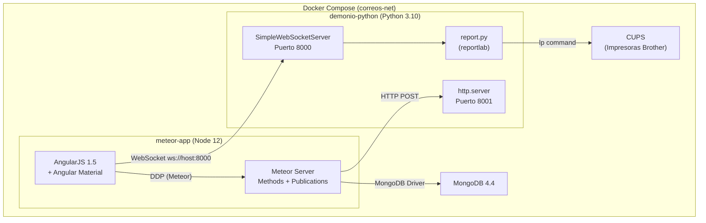
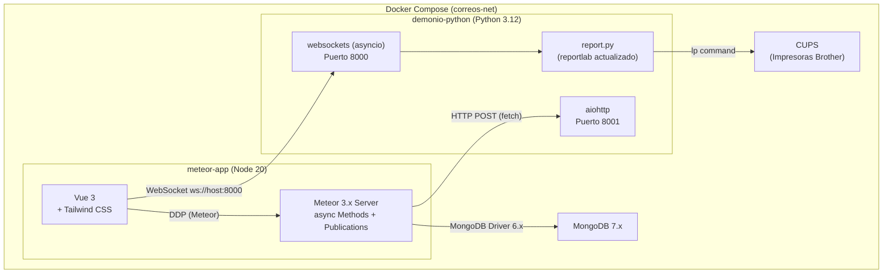
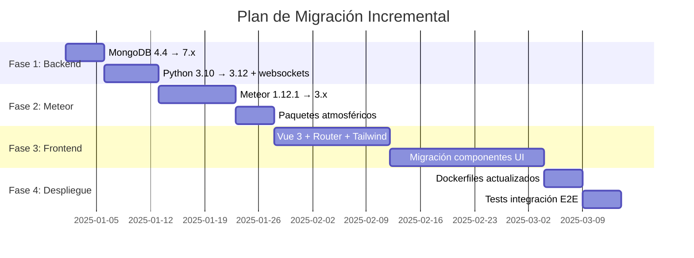

# Documento de Diseño — Migración del Stack Tecnológico

## Visión General

Este documento define la arquitectura y estrategia técnica para migrar la aplicación "correos-webapp" desde un stack obsoleto a tecnologías modernas con soporte activo. La migración se ejecuta de forma incremental en fases, garantizando compatibilidad hacia atrás y verificabilidad en cada paso.

### Objetivos de la migración

| Componente | Origen | Destino | Justificación |
|---|---|---|---|
| Meteor | 1.12.1 | 3.x | Soporte activo, async/await nativo, Node 20 |
| Node.js | 12 | 20 LTS | Seguridad, rendimiento, soporte |
| MongoDB | 4.4 | 7.x | Rendimiento, soporte, nuevas funcionalidades |
| Frontend | AngularJS 1.5 | **Vue 3** | Reactividad, ecosistema, curva de aprendizaje |
| WebSocket Server | SimpleWebSocketServer | **websockets** (Python) | Mantenido, asyncio nativo, estándar |
| Python | 3.10 | 3.12 | Rendimiento, nuevas funcionalidades |
| reportlab | actual | última estable | Compatibilidad Python 3.12 |

### Decisiones de diseño clave

**¿Por qué Vue 3 y no React o Svelte?**

1. **Reactividad integrada**: El sistema actual depende fuertemente de la reactividad de Meteor (`$reactive`, `getReactively`, `helpers`). Vue 3 con su Composition API y `ref`/`reactive` ofrece un modelo mental muy similar al actual.
2. **Curva de aprendizaje**: El equipo conoce AngularJS con templates HTML declarativos. Vue usa el mismo paradigma de Single File Components con template HTML, lo que reduce la fricción de migración.
3. **Integración con Meteor**: El paquete `vue-meteor-tracker` permite integrar la reactividad de Meteor con Vue, facilitando una migración gradual donde frontend y backend Meteor coexisten.
4. **Tamaño del bundle**: Para una aplicación de kiosko que corre en hardware específico, Vue produce bundles más pequeños que React.

**¿Por qué `websockets` y no FastAPI?**

1. **Simplicidad**: El servidor WebSocket actual es un servicio simple que recibe mensajes, parsea campos y ejecuta impresión. No necesita un framework HTTP completo.
2. **asyncio nativo**: La librería `websockets` es asyncio-nativa, permitiendo manejar conexiones concurrentes sin threads.
3. **HTTP integrado**: Para los endpoints `/pausar` y `/reanudar` (puerto 8001), se usa `aiohttp` o el servidor HTTP básico de asyncio, que es suficiente para 2 endpoints simples.
4. **Menos dependencias**: FastAPI arrastra Starlette, Pydantic y uvicorn. Para este caso de uso, `websockets` + `aiohttp` es más ligero.

---

## Arquitectura

### Diagrama de arquitectura actual



### Diagrama de arquitectura destino



### Fases de migración



---

## Componentes e Interfaces

### Mapeo de componentes (actual → nuevo)

| Componente actual | Tecnología actual | Componente nuevo | Tecnología nueva |
|---|---|---|---|
| `afkar` (módulo raíz) | AngularJS module | `App.vue` | Vue 3 root component |
| `home` | AngularJS component | `HomeView.vue` | Vue 3 SFC |
| `kiosko` | AngularJS component | `KioskoView.vue` | Vue 3 SFC |
| `imprimir` | AngularJS component | `ImprimirView.vue` | Vue 3 SFC |
| `maquina` | AngularJS component | `MaquinaView.vue` | Vue 3 SFC |
| `nav` | AngularJS component | `NavComponent.vue` | Vue 3 SFC |
| `subirImagen` | AngularJS component | `SubirImagenView.vue` | Vue 3 SFC |
| `subirImagenCrop` | AngularJS component | `ImageCropDialog.vue` | Vue 3 SFC |
| `angular-ui-router` | $stateProvider | `vue-router` | createRouter() |
| `angular-material` | md-button, md-card | Tailwind CSS | clases utilitarias |
| `angular-meteor` | $reactive, helpers | `vue-meteor-tracker` | useTracker() |
| `ng-file-upload` | AngularJS directive | HTML5 FileReader API | composable |
| `ng-img-crop` | AngularJS directive | `vue-advanced-cropper` | Vue 3 component |

### Interfaces del Servidor WebSocket (nuevo)

```python
# Interfaz del servidor WebSocket modernizado
class ServidorWebSocket:
    """Servidor asyncio que reemplaza SimpleWebSocketServer."""
    
    async def iniciar(self, host: str, port: int) -> None: ...
    async def manejar_conexion(self, websocket) -> None: ...
    async def procesar_mensaje(self, mensaje: str) -> str: ...

class ServidorHTTP:
    """Servidor HTTP para comandos de impresora (puerto 8001)."""
    
    async def iniciar(self, port: int) -> None: ...
    async def pausar(self) -> dict: ...
    async def reanudar(self) -> dict: ...

class ParseadorMensaje:
    """Parsea mensajes del protocolo *¿?* en objetos estructurados."""
    
    SEPARADOR: str = "*¿?*"
    
    def parsear(self, mensaje: str) -> OrdenImpresion: ...
    def serializar(self, orden: OrdenImpresion) -> str: ...

class GeneradorPDF:
    """Genera PDFs de sellos y tickets usando reportlab."""
    
    def generar_sellos(self, orden: OrdenImpresion) -> list[str]: ...
    def generar_ticket(self, orden: OrdenImpresion) -> str: ...
    def generar_tiras(self, orden: OrdenImpresion) -> list[str]: ...
```

### Interfaces del Frontend (Vue 3)

```typescript
// Composable para WebSocket
interface UseWebSocket {
  connect(url: string): void
  send(message: string): void
  onMessage(handler: (data: string) => void): void
  disconnect(): void
  isConnected: Ref<boolean>
}

// Composable para datos de Meteor
interface UseConfig {
  config: Ref<ConfigDocument | null>
  updateMaquina(config: Partial<ConfigDocument>): Promise<void>
  updateImprimir(config: Partial<ConfigDocument>): Promise<void>
  updateSesion(): Promise<void>
  updateRollos(sellos1: number, sellos2: number, tickets: number): Promise<void>
}

// Composable para órdenes
interface UseOrders {
  insertOrder(orders: OrderLine[]): Promise<void>
  downloadXLS(): Promise<string>
}

// Composable para imágenes
interface UseImages {
  modelo1: Ref<string | null>
  modelo2: Ref<string | null>
  uploadImage(file: File, name: string): Promise<void>
}
```

### Rutas (Vue Router)

```typescript
const routes = [
  { path: '/', redirect: '/home' },
  { path: '/home', component: HomeView },
  { path: '/kiosko', component: KioskoView },
  { path: '/imprimir', component: ImprimirView },
  { path: '/maquina', component: MaquinaView },
  { path: '/subir-imagen', component: SubirImagenView },
]
```

---

## Modelos de Datos

### Colección `config`

La estructura del documento de configuración se mantiene idéntica para garantizar compatibilidad. Se documenta aquí como referencia:

```typescript
interface ConfigDocument {
  _id: string
  ticket: {
    feria: string
    lugar: string
    fecha: string | "auto"
    hora: string | "auto"
    titulo: string
    tituloCopia: string
    rollo1: number
    rollo2: number
    tickets: number
    limiteTickets: number
    limiteImporte: number
    NUEVOlimiteImporte: number
    empresa: string
    cif: string
    cp: string
    l1: string
    l2: string
    l3: string
    T1especial: string
    T2especial: string
    T3especial: string
    TEmod1: string
    TEmod2: string
    ImprimeCopiaTicket: string
    ImprimeMasterTicket: string
  }
  codigo: {
    modo: string
    mes: number | string
    annio: string | "auto"
    pais: string
    maquina: string
    cliente: number
    producto: number
  }
  sello: {
    fecha: string
    evento: string
    modelo1: string
    modelo2: string
    modo: number
    elperfil: number
    elnperfil: string
    elnevento: string
    elevento: number
    feria: string
    lugar: string
    PERFILlimiteImporte: number
    // Eventos dinámicos (fecha0..fecha7, localidad0..localidad7)
    [key: string]: any
  }
  precios: {
    tarifaA: number
    tarifaA2: number
    tarifaB: number
    tarifaC: number
    tarifaTA: number
    tarifaT4: number
  }
}
```

### Colección `orders`

```typescript
interface OrderDocument {
  _id: string
  event: string
  venue: string
  machine: string
  vendType: string
  productName: string
  transactionDate: string
  quantity: number
  quantitySet: number
  totalStamps: number
  currency: string
  value: number
  paymentStatus: string
  sesionId: number
  etiquetasRollo1: number
  etiquetasRollo2: number
  etiquetaMes: string
  titutoEvento: string
  feria: string
  Lugar: string
  fecha: string
  mes: number | string
  annio: string
  documento: string
}
```

### Colección `images`

```typescript
interface ImageDocument {
  _id: string
  name: string        // "Modelo1" | "Modelo2"
  path: string        // Ruta al archivo de imagen
  // Campos adicionales de UploadFS (jalik:ufs)
  type?: string
  size?: number
  url?: string
}
```

### Modelo del Mensaje WebSocket (protocolo `*¿?*`)

```typescript
interface OrdenImpresion {
  id_cliente: number          // Campo 0
  id_producto: number         // Campo 1
  fecha_sello: string         // Campo 2
  evento_sello: string        // Campo 3
  fecha_ticket: string        // Campo 4
  modo_ticket: string         // Campo 5
  modelo1_ticket: string      // Campo 6
  modelo2_ticket: string      // Campo 7
  modo_maquina: string        // Campo 8
  nombre_maquina: string      // Campo 9
  mes_maquina: string         // Campo 10
  pais_maquina: string        // Campo 11
  year_maquina: string        // Campo 12
  cantidades: string          // Campo 13 (12 valores separados por espacio)
  precios: string             // Campo 14 (4 valores separados por espacio)
  empresa: string             // Campo 15
  cif: string                 // Campo 16
  cp: string                  // Campo 17
  l1: string                  // Campo 18
  l2: string                  // Campo 19
  l3: string                  // Campo 20
  feria: string               // Campo 21
  lugar: string               // Campo 22
  T1especial: string          // Campo 23
  T2especial: string          // Campo 24
  T3especial: string          // Campo 25
  TEmod1: string              // Campo 26
  TEmod2: string              // Campo 27
  ImprimeCopiaTicket: string  // Campo 28
  ImprimeMasterTicket: string // Campo 29
  modo_ticket_copia: string   // Campo 30
}
```

### Compatibilidad de datos en la migración MongoDB 4.4 → 7.x

- **Sin cambios de esquema**: Los documentos se mantienen idénticos.
- **Driver**: Actualizar `mongodb` npm package de v3.x (incluido en Meteor 1.12) a v6.x (incluido en Meteor 3.x).
- **Índices**: No se requieren nuevos índices; las colecciones son pequeñas (configuración singleton, cientos de orders).
- **Migración de datos**: `mongodump` + `mongorestore` desde MongoDB 4.4 a 7.x. Ruta compatible directamente.

---


## Propiedades de Corrección

*Una propiedad es una característica o comportamiento que debe cumplirse en todas las ejecuciones válidas de un sistema — esencialmente, una declaración formal sobre lo que el sistema debe hacer. Las propiedades sirven como puente entre especificaciones legibles por humanos y garantías de corrección verificables por máquina.*

### Property 1: Round-trip del mensaje WebSocket (parseo ↔ serialización)

*For any* mensaje válido del protocolo WebSocket (31 campos separados por `*¿?*`), parsear el mensaje en un objeto `OrdenImpresion` y luego serializar ese objeto de vuelta a string SHALL producir un mensaje equivalente al original.

**Validates: Requirements 3.3, 4.1, 4.6, 7.5, 8.4**

### Property 2: Round-trip de documentos MongoDB (escritura ↔ lectura)

*For any* documento válido de configuración (colección `config`), orden (colección `orders`) o imagen (colección `images`), escribir el documento en MongoDB y luego leerlo SHALL devolver un documento equivalente al original (excepto el campo `_id` generado).

**Validates: Requirements 2.1, 2.3, 7.6**

### Property 3: Integridad del echo WebSocket

*For any* mensaje válido del protocolo enviado al Servidor_WebSocket, la respuesta recibida por el cliente SHALL ser idéntica al mensaje enviado.

**Validates: Requirements 4.3**

### Property 4: Resiliencia ante mensajes inválidos

*For any* string que NO cumpla el formato del protocolo (número incorrecto de campos, campos vacíos, tipos incompatibles), el Servidor_WebSocket SHALL continuar operativo y aceptando nuevas conexiones después de procesar el mensaje inválido.

**Validates: Requirements 4.5**

### Property 5: Dimensiones correctas de PDFs generados

*For any* `OrdenImpresion` válida con al menos un producto con cantidad > 0, los PDFs de sellos generados SHALL tener dimensiones de 55x25mm, y los PDFs de tickets SHALL tener un ancho de 78mm.

**Validates: Requirements 5.1**

---

## Manejo de Errores

### Servidor WebSocket

| Escenario | Comportamiento esperado | Acción |
|---|---|---|
| Mensaje con formato inválido | Log del error, no crash | Registrar en log, enviar respuesta de error al cliente, continuar escuchando |
| Conexión WebSocket interrumpida | Limpieza de recurso | asyncio maneja el cierre automáticamente |
| Fallo en generación de PDF (reportlab) | Log del error, notificar al cliente | Capturar excepción, registrar, enviar mensaje de error vía WebSocket |
| Impresora no disponible (CUPS) | Log del error | Capturar código de retorno de `lp`, registrar, continuar operando |
| Puerto 8000/8001 ocupado | Fallo al iniciar | Mensaje claro en stderr, exit code 1 |

### Frontend (Vue 3)

| Escenario | Comportamiento esperado | Acción |
|---|---|---|
| WebSocket desconectado | Reconexión automática | Implementar retry con backoff exponencial |
| MongoDB sin datos de config | UI informativa | Mostrar estado de carga, ejecutar `initConfig` si vacío |
| Error en Meteor method | Alerta al usuario | Capturar error, mostrar notificación user-friendly |
| Imagen inválida para crop | Rechazo con mensaje | Validar tipo/tamaño antes de abrir el diálogo de crop |

### MongoDB

| Escenario | Comportamiento esperado | Acción |
|---|---|---|
| Conexión perdida | Reconexión automática (driver) | El driver de MongoDB 6.x maneja reconexiones automáticamente |
| Documento malformado | Rechazo en validación | Aplicar schema validation a nivel de colección (opcional, para futuro) |
| Volumen de datos lleno | Error de escritura | Log del error, notificar en UI de administración |

---

## Estrategia de Testing

### Enfoque dual: tests unitarios + tests basados en propiedades

La migración se verifica con dos capas complementarias:

1. **Tests basados en propiedades (PBT)**: Verifican propiedades universales que deben cumplirse para todos los inputs válidos. Ejecutan mínimo 100 iteraciones por propiedad.
2. **Tests unitarios/integración**: Verifican ejemplos específicos, edge cases y flujos de integración entre componentes.

### Framework de testing

| Capa | Herramienta | Justificación |
|---|---|---|
| PBT (Python) | **Hypothesis** | Estándar de facto para PBT en Python, generadores potentes |
| PBT (JavaScript) | **fast-check** | Librería PBT madura para JavaScript/TypeScript |
| Unit (Python) | **pytest** | Ya usado en el proyecto |
| Unit (JavaScript) | **Vitest** | Rápido, compatible con Vue 3, ESM nativo |
| Componentes Vue | **@vue/test-utils** + Vitest | Testing oficial de Vue 3 |
| E2E | **Playwright** | Cross-browser, soporte para WebSocket |

### Tests basados en propiedades (PBT)

Cada property-based test:
- Ejecuta mínimo **100 iteraciones**
- Referencia su propiedad del documento de diseño
- Usa tag format: `Feature: stack-migration, Property {N}: {título}`

#### Property 1: Round-trip del mensaje WebSocket

```python
# Feature: stack-migration, Property 1: Round-trip del mensaje WebSocket
# Framework: Hypothesis (Python)
# Generador: Mensajes válidos de 31 campos con tipos correctos
# Verificación: parse(serialize(parse(msg))) == parse(msg)
# Mínimo: 100 iteraciones
```

#### Property 2: Round-trip de documentos MongoDB

```javascript
// Feature: stack-migration, Property 2: Round-trip de documentos MongoDB
// Framework: fast-check (JavaScript)
// Generador: Documentos válidos de config, orders, images
// Verificación: read(write(doc))._id !== undefined && fieldsEqual(read(write(doc)), doc)
// Mínimo: 100 iteraciones
```

#### Property 3: Integridad del echo WebSocket

```python
# Feature: stack-migration, Property 3: Integridad del echo WebSocket
# Framework: Hypothesis (Python)
# Generador: Mensajes válidos del protocolo
# Verificación: response == sent_message
# Mínimo: 100 iteraciones
```

#### Property 4: Resiliencia ante mensajes inválidos

```python
# Feature: stack-migration, Property 4: Resiliencia ante mensajes inválidos
# Framework: Hypothesis (Python)
# Generador: Strings arbitrarios, mensajes con campos faltantes/extra
# Verificación: Server sigue aceptando conexiones después del mensaje inválido
# Mínimo: 100 iteraciones
```

#### Property 5: Dimensiones correctas de PDFs

```python
# Feature: stack-migration, Property 5: Dimensiones correctas de PDFs
# Framework: Hypothesis (Python)
# Generador: OrdenImpresion válidas con cantidades > 0
# Verificación: PDF width/height matches 55x25mm (sellos) o 78xN mm (tickets)
# Mínimo: 100 iteraciones
```

### Tests unitarios por fase

#### Fase 1: MongoDB 4.4 → 7.x
- Insertar/leer/actualizar/eliminar en cada colección
- Verificar que `initConfig` crea documento inicial correcto
- Verificar que `updateRollos` decrementa correctamente
- Verificar que `insertOrder` inserta múltiples líneas

#### Fase 2: Python 3.12 + websockets
- `parseMessage()` con mensajes válidos conocidos
- `parseMessage()` con mensajes edge-case (campos vacíos, caracteres especiales)
- Respuesta HTTP `/pausar` y `/reanudar` con mock de CUPS
- Conexión WebSocket se establece y mantiene

#### Fase 3: Vue 3 + Router
- Cada componente renderiza sin errores
- Navegación entre rutas funciona
- Composable `useWebSocket` se conecta y envía mensajes
- Composable `useConfig` refleja cambios reactivos
- Construcción del mensaje WebSocket con formato correcto

#### Fase 4: Docker / Integración E2E
- Los tres servicios arrancan con `docker-compose up`
- El flujo completo: seleccionar sellos → enviar WebSocket → generar PDF
- Pausar/reanudar impresora desde la UI

### Cobertura de requisitos por tipo de test

| Requisito | PBT | Unit | Integration | Smoke |
|---|---|---|---|---|
| 1.x (Meteor/Node) | — | — | — | ✓ |
| 2.x (MongoDB) | Property 2 | ✓ | ✓ | — |
| 3.x (Frontend) | Property 1* | ✓ | ✓ | — |
| 4.x (WebSocket) | Properties 1,3,4 | ✓ | ✓ | ✓ |
| 5.x (Python/PDF) | Property 5 | ✓ | — | ✓ |
| 6.x (Docker) | — | — | ✓ | ✓ |
| 7.x (Testing) | Cubierto por todas las propiedades | ✓ | ✓ | — |
| 8.x (Incremental) | Property 1* | — | ✓ | ✓ |

*Property 1 valida que el protocolo se mantiene durante toda la migración.

---

## Riesgos y Mitigaciones

| Riesgo | Probabilidad | Impacto | Mitigación |
|---|---|---|---|
| Paquetes atmosféricos de Meteor sin equivalente en 3.x | Alta | Alto | Investigar alternativas antes de migrar. `pbastowski:angular-babel` no se necesita con Vue. `urigo:static-templates` tampoco. `joncursi:socket-io-client` se reemplaza por WebSocket nativo del browser. |
| Cambios en el formato de datos de MongoDB 7.x | Baja | Alto | No hay breaking changes en el formato de documentos BSON entre 4.4 y 7.x. El dump/restore es compatible. |
| reportlab cambia API entre versiones | Media | Medio | Fijar versión exacta en requirements.txt. Ejecutar tests de dimensiones PDF. |
| Comportamiento de `$reactive` difícil de replicar en Vue | Media | Alto | `vue-meteor-tracker` proporciona `useTracker()` que es equivalente funcional. Migrar componente por componente con tests. |
| Pérdida de funcionalidad durante la migración frontend | Media | Alto | Migración incremental: mantener AngularJS funcionando mientras se migran componentes uno a uno usando un proxy de rutas. |
| WebSocket protocol `*¿?*` contiene caracteres problemáticos en encoding | Baja | Medio | Los tests de round-trip (Property 1) verifican que el separador se maneja correctamente en todos los casos. |
| Docker volume incompatibility entre MongoDB 4.4 y 7.x | Baja | Alto | Usar `mongodump`/`mongorestore` en vez de migración in-place de volumen. |
| Timeout en impresión por cambio a asyncio | Media | Medio | Mantener `time.sleep(3)` como espera post-impresión. Ejecutar `os.system("lp ...")` en `asyncio.to_thread()` para no bloquear el event loop. |
